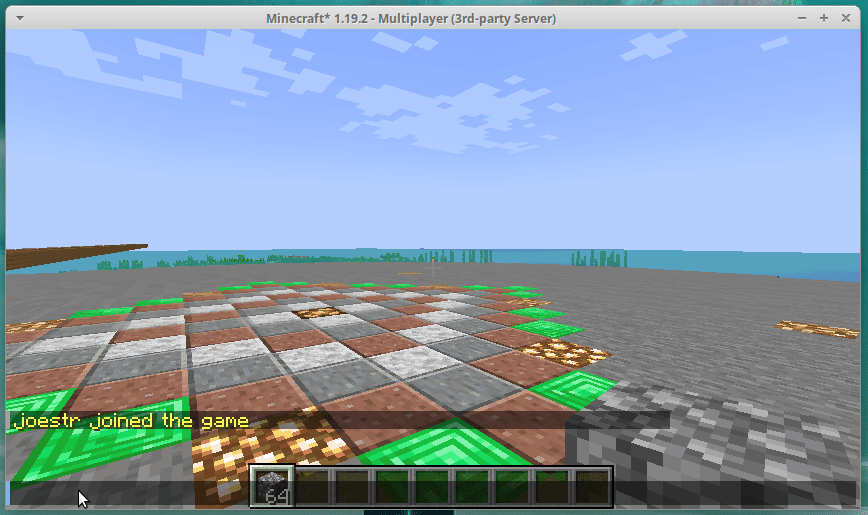
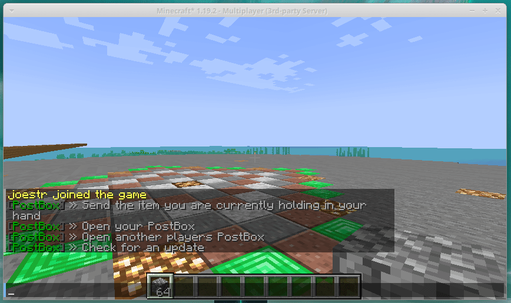
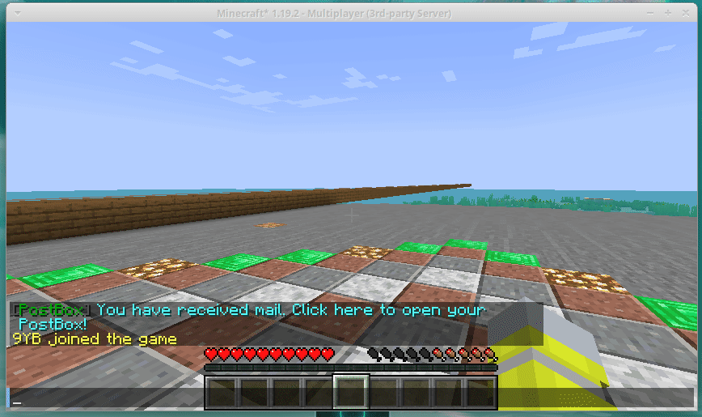

# Usage

## Command reference

### /postbox

Opens the interactive menu.

### /postbox-send

Sends the item you are holding in your hand to another player.

### /postbox-open

Opens your PostBox.

### /postbox-openother <Player>

Open the PostBox of that specific player.

### /postbox-update
Checks for an updated version of the plugin.
